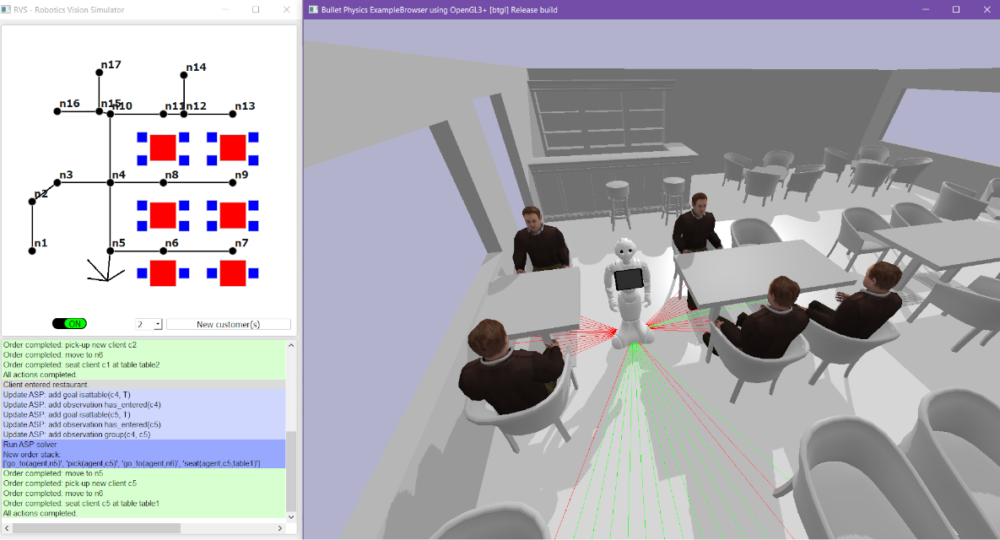
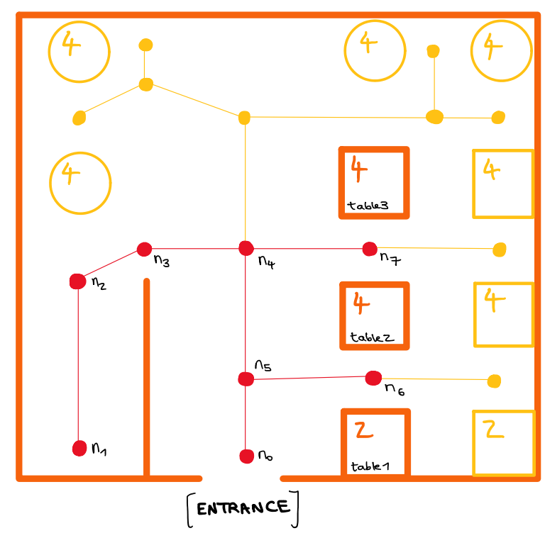
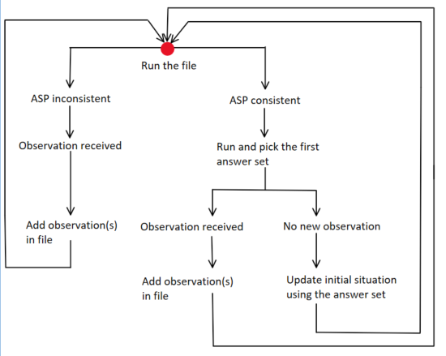

[](https://youtu.be/H-S1LGHYl4o "Commonsense Reasoning Waiter Bot | Answer Set Programming")

# Commonsens reasonning bot <!-- omit in toc -->


[](https://github.com/psf/black)

Let's teach Pepper to serve clients and work with other employees through common-sense reasoning.

- [Installation](#installation)
- [Credits](#credits)
- [Under the hood](#under-the-hood)
  - [ASP-SPARC Reasoning system](#asp-sparc-reasoning-system)
  - [Communication with the simulated environment](#communication-with-the-simulated-environment)
    - [Running the ASP file](#running-the-asp-file)
    - [Updating the ASP file and minimal planning](#updating-the-asp-file-and-minimal-planning)
    - [Managing multiple goals](#managing-multiple-goals)

## Installation

Ensure that [`Poetry`](https://poetry.eustace.io/) is installed for Python 3.8 on your system.

1. Git clone the repository

   `git clone https://github.com/ArthurFDLR/Commonsense-Reasoning-Bot`

2. Create a virtual environment with the required packages (or use the configuration file [`.\requirements.txt`](https://github.com/ArthurFDLR/Commonsense-Reasoning-Bot/blob/master/requirements.txt) in the Python 3.8+ environment of your choice)

   `python -m poetry install`

3. You should now be able to run the application
   
   `make run` or `poetry run python .\commonsense-reasoning-bot`

## Credits

Many thanks to [Mohan Sridharan](https://www.cs.bham.ac.uk/~sridharm/) for his guidance during this project.

[Chloe Benz](https://www.linkedin.com/in/chloe-benz/) implemeted the [ASP program](./commonsense_reasoning_bot/ASP/ProgramASP.sparc) and wrote the majority of the text bellow.

## Under the hood

The project is split into two distinct parts, which communicate with each other. On one side, the knowledge base and planning module enables the agent to plan its actions.  On the other, the simulated world mimics a simple restaurant and includes clients, employees, furniture, objects, and so on. Minimal works are thus necessary to deploy the reasoning system on the real bot.

### ASP-SPARC Reasoning system

An ASP-SPARC file has three main sections, which are:

- **sorts** - to declare "types", "variables" and (in this context) fluents and actions that the agent can perform
- **predicates** - to declare the predicates on which the rules will be based, a predicate is always either true, false, or unknown (i.e. it is not known if it is true or false)
- **rules** - to declare the rules of the knowledge domain


Those sections must appear in the order given below, and each section starts at its (eponymous) section keyword and ends when another section keyword is written. Constants can be defined before the **sorts** section, at the very beginning of the file, using a command of the form:

```const n = 4```

Another (optional) section is **display**, which can be used to set which subsets of the answer sets are displayed (very useful when there are a lot of ground terms at play). Note that the line comment character is \%, and that every line has to end with a dot, except the lines containing the section keywords.

A significant improvement from ASP is that ASP-SPARC has sorts, which adds some class/type features that render the language more robust and legible. With that, each time an instance is declared and evaluated with the wrong sort, the program returns an error, which prevents some logical inconsistencies that could have easily been missed otherwise.

The initial idea was to create a simple restaurant domain incorporating the following instances:

- **waiter**, **agent** and **customer** where **employee = \{waiter, agent\}** and **person = \{waiter, customer\}**
- **table**, **chairs**, **bar** where **furniture = \{table, chairs, bar\}**
- **basket**, **jug**, **plate**, **badge** where **refillable = \{basket, jug\}** and **object = \{basket, jug, plate\}**
- **node**

The items underlined are the ones that made it into the version used in the simulator. However, the others can still be added into the ASP file to reason on and the associated actions and rules - except maybe for the chairs, which would cause a total redesign of the seating rules. The first version of the knowledge domain actually featured chairs associated with a table and to a customer. Still, this structure was abandoned because it was challenging to find a working seating process. Instead, (groups of) customers are now associated with the table they are sat at, assuming there are enough chairs to accommodate them. To really check if there are enough chairs at a table, a fluent ```has_chairs(#num(N), #table(T))``` can be added to the actual program without much work. If the number of chairs matches the table's maximum capacity, then the table is in its "default state" and ok to use. If there are fewer chairs than the table's capacity but that the group of customers that are meant to be sat down somewhere has a lower headcount than the number of chairs, then the table is also ok to use. Otherwise, an action ```bring_chairs(#employee(E), #table(T), #num(N))``` could be added to the list of actions that the agent can perform.

Speaking of actions, the following actions were initially thought of:

- ```go_to(#employee(E), #node(N), #node(N))}``` - to track the agent and waiters' positions on defined nodes in the restaurant
- ```pick(#employee(E), #customer(Cu))}``` - to pick clients arriving in the restaurant 
- ```seat(#employee(E), #customer(Cu), #table(T))}``` - to seat clients that have been picked up at a table
- ```give_bill(#employee(E), #table(T))}``` - to give the bill to a table 
- ```bring(#employee(E), #object(O), #table(T))``` - to bring any item (food, bread or water) at a table
- ```refill(#employee(E), #refillable(R), #table(T))``` - to pick an empty jug or bread basket on a table and to refill it - needs to be followed by the ```bring``` action
- ```take_order(#employee(E), #table(T))``` - to take the order from a table
- ```send_order(#employee(E), #table(T))``` - to send the order from table T to the kitchen

Again, the actions underlined are the ones that made it into the actual version of the knowledge base, but the other ones can still be added on top of it, provided the right fluents are added in the process. In the actual state of the ASP-SPARC file, only the agent is able to "perform" the actions. Since the knowledge domain is from the agent's point of view, the answer sets will contain grounded terms such as ```go_to(agent, n0)``` but never ```go_to(w1, n0)``` (w1 being the waiter labeled as 1 on shift at the same time as the agent). The ASP-SPARC file does not have a diagnostic module at this time - which means it cannot generate explanations for - for instance - a waiter's whereabouts in the restaurant. If waiters were to perform actions and were observed to be where the knowledge base does not expect them, the program would be inconsistent. 

Out of the fluents, instances, and actions that have been implemented in the current version of the ASP-SPARC file, the ```node``` sort and the ```go\_to``` actions hold a central place. The nodes are used to simplify the displacements of the agent and waiters in the restaurant. The map of the restaurant was defined arbitrarily:

<p align="center">
    
</p>

The tables in orange (named ```table1```, ```table2``` and ```table3```) and paths and nodes (named ```$n_{i}$``` for i in [0;7]) in red are the instances that can be actually reasoned upon. The rest of it (in yellow) can be seen in the simulation but not interacted with at all. This can be changed by adapting lines 140 to 141, 147 to 152, and 161 to 163 to define the capacity of each table, the paths between nodes and the tables that are reachable from a certain node, without forgetting to increment the constants ```tnum```, ```nnum``` and ```maxcap``` if a table of more than 4 people capacity is needed.  

This restaurant layout can be easily changed and only necessitates a rather easy (but manual, for now) instantiation of the ASP-SPARC file. The initial idea was to include the layout generation in the GUI so that the ASP can be broadly used without much manual changes in the code. What the user has control over is the number of tables, the number of nodes, and how the nodes are placed regarding the tables and the restaurant entrance. The exact layout can be set in the simulated world (see presentation video of the PyBullet environment). The simulated world is necessary in the sense that it puts in perspective the nodes' locations in the chosen restaurant layout. But if the ASP-SPARC program were to be used in the real world, a simple sketch of the restaurant would be sufficient to instantiate everything correctly. 

### Communication with the simulated environment

#### Running the ASP file

Running the ASP file to retrieve the answer sets is straightforward and can be done using very few lines of code. The **display** section keyword can here be handy since it can restrict the displayed computed answer sets to whatever fluents are needed. What was done here is a bit different since the time ordering of the fluents is important for clarity and quick debugging. Usually, answer sets are displayed in no particular order, which is not convenient in that case. A [small Python script](https://github.com/niwya/restaurant_ASP_SPARC/blob/master/output_reorderer2.py) was used. Each fluent or action or observation appear in instances of the form:

```
holds(F(A_f, B_f, ...), I).
occurs(A(A_oc, B_oc, ...), J).
obs(O(A_ob, B_ob, ...), K).
```

Where I, J, K are integers representing the time steps. What the Python script does is it reorders the fluents/actions/observations from the answer sets regarding the time step they occurred at. With this script, a keyword search within the answer sets is possible, and the user can choose the number of answer sets displayed. Pieces from that code are used in the communication script that allows the simulation to reason with and update the knowledge base, with a few tweaks because the script described in this section is not time-efficient. 

Some of the features of the Python script mentioned before have been kept and integrated into [the communication script](./commonsense_reasoning_bot/ASP/CommunicationASP.py). The lines from 226 to 285 feature those in a way that's a little bit more efficient than the code mentioned in the previous section. The ASP-SPARC file can actually be run with a single command (see line 217 in the ```get_minimal_plan()``` function body). The answer set (only one is needed, here - technically, the one that gives the lowest number of actions to be performed - because laziness) is then reordered with regard to time and fed to the simulation.

#### Updating the ASP file and minimal planning

The ASP-SPARC knowledge base needs to be accessed and updated at each step of the simulation, which means the communication script has to be rather efficient.

There is no way to directly code a planning module that does minimal planning in ASP-SPARC (though it is feasible in classic ASP, and some other answer set programming languages to allow that too). Thus, a Python script was added to the communication program. It starts computing answer sets with N=0 (i.e. it tries to compute single-step answer sets). If the output is "The SPARC program is inconsistent.", then it increments N and tries running again - and repeats until it finds a non inconsistent answer set. This is only possible if there exists such an answer set, which is not always true. This method can work fairly well, though, with a threshold on N so that it does not enter an endless loop. A better way would be searching the minimal N using dichotomy, so that the number of times the ASP has to run is minimized too. At this time, there is no way to be sure that the ASP to run has a consistent answer set. An amelioration of the communication program would include this feature if there is an efficient and costless way to do so.

How the ASP is ran and updated based on new observations received from the simulation is represented below:

<p align="center">
    
</p>

Note that for now, the observations sent from the simulator must be inputted somehow by the user. This can be seen in the video linked in the appendix, with the "make the customer want the bill" part at the end. 

#### Managing multiple goals

It is possible to manage multiple goals at once if those goals are not conflicting and do not require to be executed in a specific order. By that, it is meant that a new client arriving, for instance, and a client demanding the bill are treated in the order that gives the minimal plan (i.e., the least number of actions required).
If some goals need to be managed in a specific order, it is easy to set up rules so that a specific observation triggers a fluent that triggers an action, resulting in another observation or change of state of fluent and so on. 
